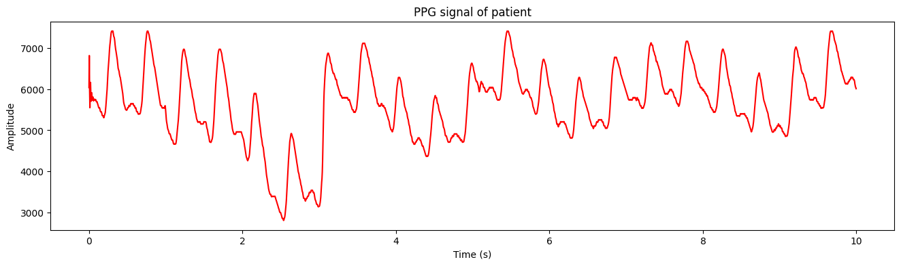
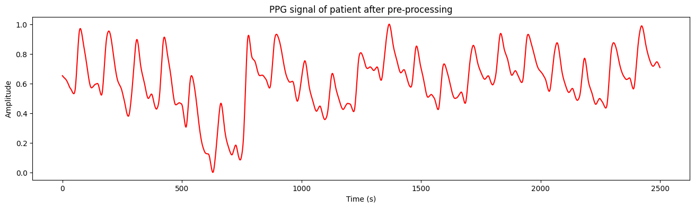
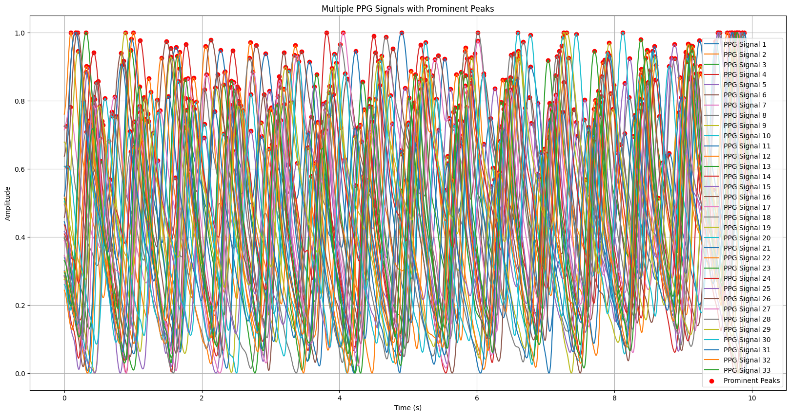
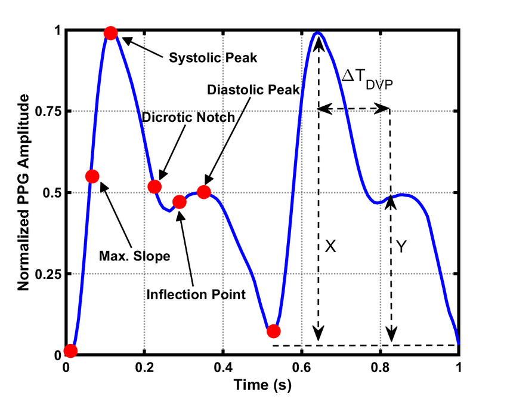
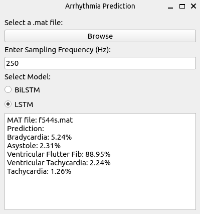
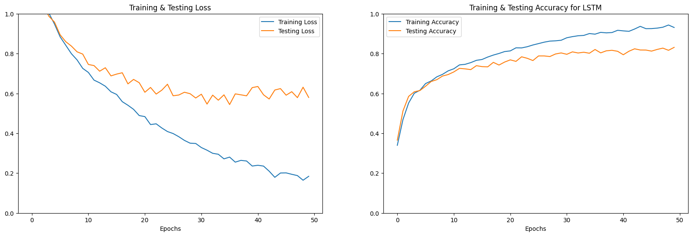
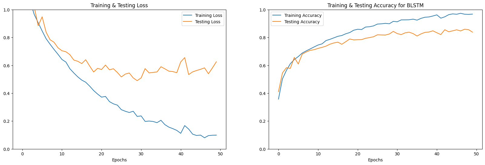

# Cardiac Arrhythmia Classification using RNN

## Overview
This repository contains code for classifying cardiac arrhythmias using Recurrent Neural Network (RNN) architectures, specifically Long Short-Term Memory (LSTM) and Bidirectional LSTM (BLSTM), trained on raw photoplethysmogram (PPG) signals. 

## Abstract
Cardiovascular diseases (CVDs) stand as the leading global cause of death, prompting the need for continuous monitoring to detect them early in at-risk individuals. Traditional methods like electrocardiograms (ECGs) have drawbacks such as false alarms and discomfort from electrodes, prompting a recent shift towards the use of photoplethysmogram (PPG) signals. PPG provides a non-invasive, cost-effective way to assess cardiac activity. This project utilizes PPG signals from a reputable database to classify different cardiac arrhythmias. Signal pre-processing techniques are applied to remove noise and artifacts before feature extraction. A comprehensive set of features is used, and classification is performed using two machine learning Recurrent Neural Network (RNN) algorithms: Long Short-Term Memory (LSTM) and Bidirectional Long Short-Term Memory (BLSTM).

## Objectives
The objective of this project is to apply Recurrent Neural Network (RNN) techniques more specifically Long Short-Term Memory (LSTM) and Bidirectional Long Short-Term Memory (BLSTM) to train a model to recognise the type of cardiac arrhythmia.

## Motivation
Heart diseases are the leading cause of death worldwide, with irregular heartbeats known as cardiac arrhythmias posing a serious risk. These arrhythmias result from abnormal electrical impulses in the heart, disrupting its rhythm and affecting blood circulation. There are different types of arrhythmias like tachycardia, which speeds up the heart rate, and bradycardia, which slows it down. Detecting and monitoring these conditions is crucial for preventing heart attacks.

The standard method for monitoring arrhythmias is through electrocardiograms (ECGs), which record the heart's electrical activity. Researchers are working to improve this process by refining techniques to process ECG signals, extract useful information, and classify arrhythmias using advanced technology like machine learning. This work aims to create better systems for spotting heart irregularities early on, helping to save lives.

This projrct exclusively utilized the PPG signal to identify arrhythmias. The detection stage employed a variety of features, including morphological, statistical, and frequency domain features, to investigate four types of cardiac arrhythmias, namely bradycardia, tachycardia, ventricular fibrillation or flutter (VFB), and ventricular tachycardia (VTA)

## Methodology
### Dataset Extraction
PPG waveforms from the PhysioNet/Computing in Cardiology Challenge 2015 database were used for training and validation. These databases contain over 750 raw waveforms from bedside monitors in intensive care units (ICUs), each consisting of two ECG leads and at least one pulsatile waveform of either PPG or arterial blood pressure (ABP) waveform for a duration of 5 min. Each waveform is associated with an alarm that indicates either a true or false arrhythmia event. For this study, only PPG waveforms with true alarms were considered. These are the information for each signal present in the dataset.

```
{
 'file_name': 'a103l',
 'num_signals': 3,
 'frequency': 250,
 'num_samples': 82500,
 'ADC_resolution': '16+24',
 'ADC_gain': '1.253e+04/NU',
 'ADC_bits': 16,
 'ADC_zero': 0,
 'initial_value': 6042,
 'check_sum': -17391,
 'block_size': 0,
 'description': 'PLETH',
 'electrical_activity': 'Asystole',
 'validity': 'False alarm'
}
```


### Signal Pre-Processing
The preprocessing step was used to prepare the data for feature extraction. The preprocessing includes filtration of the signal utilizing a bandpass filter between (0.05 Hz to 30 Hz). Furthermore, the signal smoothing using moving average filter, then, the baseline wandering was removed using wavelet transform followed with signal normalization. Each waveform was segmented into 10-s intervals.



### Peak Detection
After the initial preprocessing, the next step focused on extracting peaks from the processed PPG signals. This involved employing a convenient function from the scipy.signal module, specifically designed to pinpoint peaks within data. To ensure that only significant peaks were retained, a threshold was established, taking into account the maximum width typically associated with pulsatile signals. This careful thresholding method contributed to the accurate identification of crucial points within the segmented PPG signals, enabling a more refined analysis of the data.



### Feature Extraction
Feature extraction is a crucial process that is necessary to identify the significant features in the signals that are pertinent to the conditions and arrhythmias being investigated. The PPG signal is capable of encoding information pertaining to cardiac arrhythmias, given that these arrhythmias have an impact on the characteristics of the PPG waveform. 



This project involved the extraction of 29 features from the PPG signal, encompassing both morphological and frequency domain features. The mean and standard deviation were also calculated for all features.

1. **Signal Amplitude (sa)**: The maximum amplitude of the PPG waveform, representing the peak blood volume.
2. **Dominant frequency amplitude (Da)**: The amplitude corresponding to the dominant frequency component in the PPG signal.
3. **Spectral Amplitude (SA)**: The maximum amplitude in the frequency domain of the PPG signal.
4. **Dominant frequency (DA)**: The frequency with the highest amplitude in the PPG signal, often corresponding to the heart rate.
5. **Signal Duration (St)**: The duration of the PPG signal, indicating the time span over which measurements are taken.
6. **Dominant frequency Duration (Dt)**: The duration of the dominant frequency component in the PPG signal.
7. **Peak Index (PI)**: The index of the peak in the PPG signal, indicating the position of the peak in the time series.
8. **Peak to Peak Index (PPI)**: The index of the peak-to-peak interval in the PPG signal.
9. **Pulse Width (PW)**: The width of the pulse in the PPG signal, representing the duration of a heartbeat.
10. **Full Width at Half Maximum (FWHM)**: The width of the peak at half of its maximum amplitude, often related to pulse duration or shape.

The rest of the features encompass various aspects of the PPG signal, including its frequency domain complexity (Spectral Entropy), rise and fall times indicating blood volume changes, amplitude modulation depth reflecting volume variations, overall energy, zero crossing rate revealing waveform characteristics, mean, median, and standard deviation portraying intensity and variability, skewness and kurtosis showing distribution shape, minimum and maximum values indicating signal range, variance representing dispersion, slope indicating temporal change rate, peak count for morphology analysis, amplitude and area ratios for signal characteristics comparison, and interval ratio for temporal pattern evaluation.

### Model Architecture
The total trainable parameters for this model amount to 136,901. Both models aim to efficiently capture the underlying patterns in the input data and map them to appropriate action values, facilitating effective decision-making in the given environment.

#### Model 1: LSTM-based Architecture

The first model employs a sequential architecture consisting of LSTM layers to approximate the Q-values. The architecture is as follows:

| Layer (type) | Output Shape | Param | Trainable params |
|--------------|--------------|-------|------------------|
| LSTM         | (None, 31, 64) | 16896 | 16896 |
| LSTM         | (None, 64)     | 33024 | 33024 |
| Dense        | (None, 32)     | 2080  | 2080  |
| Dense        | (None, 5)      | 165   | 165   |

The total trainable parameters for this model are 52,165.

#### Model 2: Bidirectional LSTM-based Architecture

The second model utilizes a bidirectional LSTM architecture to approximate the Q-values. The architecture is structured as follows:

| Layer (type)   | Output Shape    | Param | Trainable params |
|----------------|-----------------|-------|------------------|
| Bidirectional | (None, 31, 128) | 33792 | 33792            |
| Bidirectional | (None, 128)     | 98816 | 98816            |
| Dense         | (None, 32)      | 4128  | 4128             |
| Dense         | (None, 5)       | 165   | 165              |

### Model Training
The LSTM and Bidirectional LSTM models were trained using both untrained and trained datasets.  The evaluation metrics for both untrained and trained datasets are presented below:

- **LSTM Evaluation (Untrained Dataset):** Loss: 0.589, Accuracy: 82.79%
- **BiLSTM Evaluation (Untrained Dataset):** Loss: 0.629, Accuracy: 83.95%
- **LSTM Evaluation (Trained Dataset):** Loss: 0.149, Accuracy: 94.82%
- **BiLSTM Evaluation (Trained Dataset):** Loss: 0.095, Accuracy: 96.89%

The evaluations were conducted on a dataset comprising 15,949 feature arrays with associated labels, combining both training and validation sets. The dataset was split into 70% for training and 30% for validation to ensure robust model training and effective evaluation of generalization performance.

The training process spanned 50 epochs, enabling iterative refinement of model parameters and optimization of predictive performance.

## GUI
The model was trained and tested in Google Colab and then imported to Visual Studio Code. A simple Graphical User Interface was build using PyQt  from our PC. The model then makes a prediction, which is
displayed.



## Results and Discussion
The training and validation metrics are plotted as a function of the number of epochs. It is to be noted that the validation accuracy and the training accuracy increase as the number of epochs increases while the training loss decreases as the number of epochs increases. These are generally positive signs indicating that the model is learning and generalizing well. 

However, it is observed that the validation loss decreases initially but then starts to increase, even as the training loss continues to decrease. This is a clear sign that overfitting has started to occur. When the model learns the training data too well, including noise and minor fluctuations, and fails to generalize well to new, unseen data, it is termed as overfitting. Thus, early stopping has been implemented to prevent overfitting from occurring.




## Performance Evaluation Metric

The confusion matrices for the LSTM and BLTSM models were obtained by testing the models using both untrained and trained datasets. These matrices compare the models' predictions to the actual labels and include four metrics: True Positives (TP), True Negatives (TN), False Positives (FP), and False Negatives (FN). In this context, the event being detected is the presence of Arrhythmia. Therefore, a true positive represents a case in which Arrhythmia is present and detected, and so on. The evaluation provides insights into the models' performance in correctly identifying Arrhythmia instances.

The following metrics can be used to evaluate the performance of the model:

- **Sensitivity (SE) / Recall / True Positive Rate:** It measures the fraction of actual positive instances (true events) that are correctly predicted by the model. It is given by

  $$
  SE = \frac{TP}{TP + FN}
  $$

- **Specificity (SP) / True Negative Rate:** It measures the fraction of actual negative instances (non-events) that are correctly predicted by the model. It is given by

  $$
  SP = \frac{TN}{TN + FP}
  $$

- **Overall Accuracy (ACC):** It measures the proportion of correct predictions (both true positives and true negatives) out of the total predictions made by the model. It is given by

$$
ACC = \frac{TN + TP}{TN + TP + FN + FP}
$$

### Performance Evaluation of LSTM Model

The LSTM model demonstrates strong performance on both untrained and trained datasets. The performance metrics for the LSTM model are summarized below

| Dataset    | Accuracy | Sensitivity | Specificity |
|------------|----------|-------------|-------------|
| Untrained  | 0.927    | 0.944       | 0.915       |
| Trained    | 0.975    | 0.980       | 0.970       |

 

### Performance Evaluation of BLSTM Model

The BLSTM model also exhibits impressive performance on both untrained and trained datasets. The performance metrics for the BLSTM model are summarized below

| Dataset    | Accuracy | Sensitivity | Specificity |
|------------|----------|-------------|-------------|
| Untrained  | 0.940    | 0.937       | 0.942       |
| Trained    | 0.989    | 0.995       | 0.984       |

 


## Conclusion and Future Perspective
Further refinement of the models, including feature set expansion and training with larger datasets, holds promise for improving performance. Adjusting classification thresholds and exploring specialized feature extraction methods are potential avenues for enhancement.

## References
- [Photoplethysmography Based Arrhythmia Detection and Classification](https://ieeexplore.ieee.org/document/8684801)
- [Cardiac Arrhythmias Classification Using Photoplethysmography Database](https://pubmed.ncbi.nlm.nih.gov/10858029/)
- [Cardiac Arrhythmia Detection Using Photoplethysmography](https://ieeexplore.ieee.org/document/7953658)
- [PhysioNet Challenge 2015 Dataset](https://archive.physionet.org/physiobank/database/challenge/2015/training/RECORDS)
